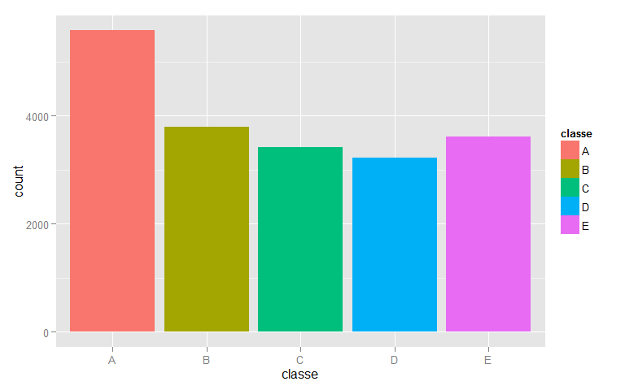
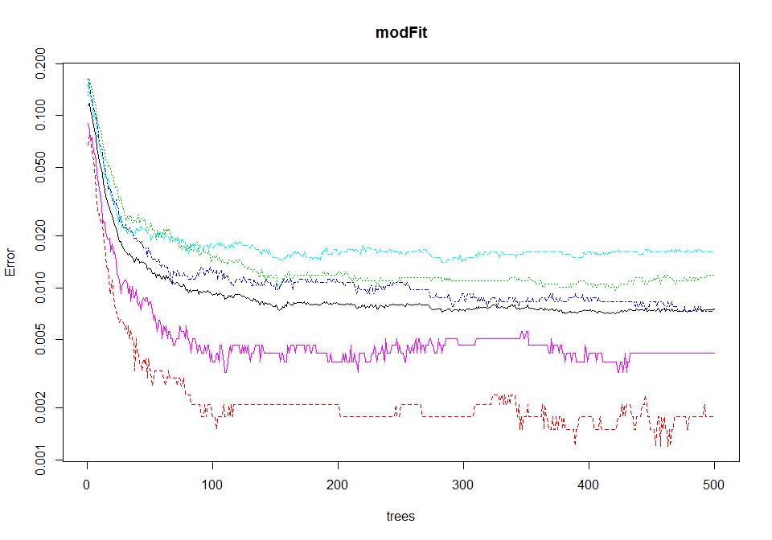
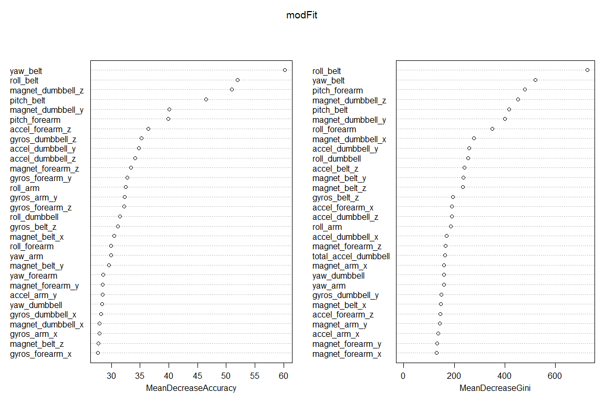

# Study on Human Activity Recognition
Sofia Cividini  
Friday, November 21, 2014  

### Synopsis.

Thanks to new technological devices it is now possible to collect a large amount of data about personal activity without an excess of costs. Through these devices, people are able to collect by themselves a great quantity of data about their physical activity in order to improve their health, to find patterns in their behavior, or because they are tech geeks. 
In general, people are more concentrated on quantifying <strong>how much</strong> of a particular activity they do, rather than quantifying <strong>how well</strong> they do that activity. In this project, the goal was to create a model which was able to classify data from accelerometers on the belt, forearm, arm, and dumbbell of 6 participants, who were asked to perform barbell lifts correctly and incorrectly in 5 different ways. The data for this project come from this source: http://groupware.les.inf.puc-rio.br/har. 
The overall data set consisted of 19622 observations and 160 predictors. After an opportune action of data cleaning, I got a data set with 19622 observations and 53 predictors. I subdivided this data set into other two data sets, one with the 60% of observations and the other one with the 40% of observations. Then, I applied a model for the classification which uses an algorithm based on the <strong>random forests </strong>. 


```r
pml.training <- read.csv("C:/Users/Sofia Cividini/Documents/COURSERA COURSES/Data Science Specialization_JHU/Practical Machine Learning/Assignment1_Write up/pml-training.csv", header=TRUE, sep=",")
dim(pml.training)
```

```
## [1] 19622   160
```


```r
library(caret)
```

```
## Loading required package: lattice
## Loading required package: ggplot2
```

```r
library(randomForest)
```

```
## Warning: package 'randomForest' was built under R version 3.1.2
```

```
## randomForest 4.6-10
## Type rfNews() to see new features/changes/bug fixes.
```

* I deleted all the columns where the data are almost all missing. This way I reduced the data set dimension at 19622 observations and 60 predictors.


```r
pml.training2 <- pml.training[,-c(12:36, 50:59, 69:83, 87:101, 103:112, 125:139, 141:150)]
# pml.training2 <- edit(pml.training2) 
# attributes(pml.training2)
dim(pml.training2)
```

```
## [1] 19622    60
```

* Then, I deleted all the other variables which were not to be considered, and I held only the predictors corresponding to belt, forearm, arm, and dumbbell. This way I reduced the data set dimension at 19622 observations and 53 predictors.


```r
pml.training3 <- pml.training2[,-c(1:7)]
# pml.training3 <- edit(pml.training3) 
dim(pml.training3)
```

```
## [1] 19622    53
```

#### Exploratory Analysis.

I did a plot to see the frequency of the 5 different levels of the "classe" variable. The highest frequency is equivalent to the level A, while the lowest frequency is equivalent to the level D.


```r
plot <- ggplot(pml.training3, aes(x=classe, fill=classe)) + geom_histogram()
plot 
```

 


#### Model with an Algorithm based on Random Forests .

* I subdivided the data set called pml.training3 in a training data set (60% of observations) and in a test dataset (40% of observations). I did so in order to reduce the time of calculation because it would not be problems of overfitting with the random forests. 


```r
inTrain <- createDataPartition(y=pml.training3$classe, p=0.6, list=FALSE)
training <- pml.training3
training <- pml.training3[inTrain,]
testing <- pml.training3[-inTrain,]
dim(training); dim(testing)
```

```
## [1] 11776    53
```

```
## [1] 7846   53
```

* I used the training data set (with the 60% of observations) in order to fit my model through randomForest() function. The model has an OOB estimate of the error rate rather good, and it is able to classify in a correct way most of the observations in the data set. In fact, as you can see from the confusion matrix, most of the observations are on the main diagonal.


```r
set.seed(12345)
modFit <- randomForest(classe ~ ., data=training, proximity=TRUE, importance=TRUE)
print(modFit)
```

```
## 
## Call:
##  randomForest(formula = classe ~ ., data = training, proximity = TRUE,      importance = TRUE) 
##                Type of random forest: classification
##                      Number of trees: 500
## No. of variables tried at each split: 7
## 
##         OOB estimate of  error rate: 0.76%
## Confusion matrix:
##      A    B    C    D    E class.error
## A 3342    4    1    0    1    0.001792
## B   16 2252   11    0    0    0.011847
## C    0   14 2038    2    0    0.007790
## D    0    0   27 1899    4    0.016062
## E    0    0    1    8 2156    0.004157
```

* This plot shows the trend of the error along the 500 trees which were considered by the model.


```r
plot(modFit, log="y")
```

 

* I also took a look at the most important variables. As we can see in the following graph, there are 30 predictors out of 53 used which are important for the classification.


```r
varImpPlot(modFit)
```

 

* I did a prediction on the testing data set with the 40% of observations.


```r
prediction <- predict(modFit, testing)
testing$predRight <- prediction==testing$classe
table(prediction, testing$classe)
```

```
##           
## prediction    A    B    C    D    E
##          A 2231    7    0    0    0
##          B    1 1509    9    0    0
##          C    0    2 1356   15    0
##          D    0    0    3 1271    1
##          E    0    0    0    0 1441
```


It seems that the model worked very well even in prediction on the testing data set as we can see from the confusion matrix.

